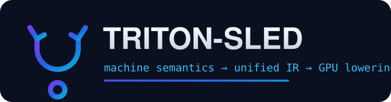

<div align="center">



# TRITON-SLED

**A multi-frontend machine-semantics toolkit: from processor specifications to a unified IR to data-parallel GPU lowering.**

[](LICENSE)
[](GOVERNANCE.md)
[](triton_agent1.h)
[](triton_machine_semantics/)
[](sled/)
[](triton_machine_semantics/pcode.py)
[](sled/core.tla)
[](run_tests.py)

<sub>authors · <b>ahmedparr93@gmail.com</b> · <b>SNAPKITTYWEST</b></sub>

</div>

---

## Table of contents

- [What this is](#what-this-is)
- [Design principles](#design-principles)
- [Repository layout](#repository-layout)
- [The pipeline at a glance](#the-pipeline-at-a-glance)
- [Component 1 — the C11 compiler core (`triton_agent1`)](#component-1--the-c11-compiler-core-triton_agent1)
- [Component 2 — the machine-semantics package](#component-2--the-machine-semantics-package)
  - [SLEIGH frontend](#sleigh-frontend)
  - [SLED frontend](#sled-frontend)
  - [SSL / RTL frontend](#ssl--rtl-frontend)
  - [The low-level frontends](#the-low-level-frontends)
  - [P-code: the semantic backbone](#p-code-the-semantic-backbone)
  - [Machine IR (MIR)](#machine-ir-mir)
  - [Lowering to Triton and PTX](#lowering-to-triton-and-ptx)
- [Component 3 — the SLED language](#component-3--the-sled-language)
- [Component 4 — the TLA+ specification](#component-4--the-tla-specification)
- [Getting started](#getting-started)
- [Worked examples](#worked-examples)
- [Testing and verification](#testing-and-verification)
- [Extending TRITON-SLED](#extending-triton-sled)
- [Design decisions and non-goals](#design-decisions-and-non-goals)
- [Licensing and governance](#licensing-and-governance)
- [Provenance](#provenance)
- [Authors](#authors)

---

## What this is

TRITON-SLED is a **machine-semantics toolkit**. It takes descriptions of how a
processor — real, historical, or invented — behaves, and turns those
descriptions into something executable, analyzable, and, where the shape of the
computation permits, lowerable to a GPU.

The word "machine semantics" is doing a lot of work here, so it is worth being
precise about it. A great deal of software concerns itself with *syntax*: what a
program looks like, how it is written, how it parses. TRITON-SLED is concerned
with *semantics*: what a program **means** when a machine runs it. When you say
`ADD R0, R1, R2`, what actually happens? Which storage locations are read? Which
are written? What is the width of the arithmetic? What are the side effects on
flags, on the program counter, on memory? Machine semantics is the discipline of
answering those questions formally enough that a computer can answer them for
you.

This matters in a surprising number of places. It matters in **decompilation and
binary analysis**, where you have bytes and you want to recover meaning. It
matters in **retargetable compilation**, where you want to describe a new target
once and get a working toolchain. It matters in **emulation**, where you want to
run one machine's code on another. It matters in **formal verification**, where
you want to prove that a transformation preserves behavior. And it matters in
**high-performance computing**, where you want to recognize when a chunk of
generic computation is secretly a data-parallel kernel that a GPU could run
thousands of times faster.

TRITON-SLED is built around a single conviction: all of these use cases want the
*same* intermediate representation of meaning. If you can get from any input
language into a common, well-defined semantic core, you get every downstream
capability for free. That common core, in this project, is **P-code** (a
register-transfer semantic model in the tradition of the SLEIGH/Ghidra
ecosystem) feeding a **unified Machine IR (MIR)**. Everything upstream is a
frontend; everything downstream is a consumer.

The name is a portmanteau. **TRITON** is the parallel-kernel and lowering
ambition — the trident that reaches toward GPU targets. **SLED** is the
specification language at the front of the pipeline (and a nod to the classic
"Specification Language for Encoding and Decoding" lineage of machine
descriptions). Together they name the arc this repository draws: from a formal
description of a machine, all the way down to code a modern accelerator can run.

---

## Design principles

TRITON-SLED holds itself to a small number of principles, and they explain most
of the choices you will find in the code.

**1. Executable over aspirational.** Every layer in this repository *runs*. The
lexers lex, the decoders decode, the P-code engine executes, the lowering
pipeline emits real kernels. Nothing is a stub that "would work if finished."
Where a construct is not yet supported, the code says so explicitly rather than
silently producing something plausible-looking and wrong.

**2. Documented subsets, never invented history.** Several of the input
languages TRITON-SLED accepts are historical or based on published
specifications. The parsers implement a **documented public subset** of each,
and they say so in their module docstrings. The project deliberately does not
fabricate undocumented syntax to look more complete than it is. A parser that
handles a clean, real subset is worth more than one that hallucinates a language.

**3. Fail closed, and fail loud.** When the P-code lowering meets a statement it
does not understand, it emits an explicit `UNIMPLEMENTED` opcode — a marker you
can search for, count, and act on — rather than dropping the statement. When the
GPU lowering meets computation that is not data-parallel, it returns `None`
*with a reason string*, never a broken kernel. Silence is the enemy of
correctness.

**4. Separation of frontends.** Each source language gets its own module. No
frontend is quietly treated as another. This keeps the semantics of, say,
JOVIAL distinct from the semantics of CMS-2, even though they share the same
downstream IR. Contamination between frontends is a category of bug this layout
makes structurally hard to introduce.

**5. Verification is a first-class artifact.** The pipeline's promotion
semantics are specified in TLA+ and checked as invariants, not just described in
prose. Correctness properties that can be stated formally, are.

---

## Repository layout

```
new-repo/
├── README.md                     ← you are here
├── LICENSE                       ← full MPL-2.0 text
├── GOVERNANCE.md                 ← copyleft node-governance charter
├── assets/
│   └── logo.svg                  ← project mark
├── build.sh                      ← C build + smoke run
├── run_tests.py                  ← end-to-end executable test harness
│
├── triton_agent1.h               ← C11 compiler infrastructure (header-library)
├── triton_agent1.c               ← C11 lexer/dialect core
├── triton_agent1_main.c          ← C11 executable driver
│
├── triton_machine_semantics/     ← the Python toolkit (importable package)
│   ├── __init__.py
│   ├── sleigh_ast.py             ← processor-spec AST
│   ├── sleigh_parser.py          ← SLEIGH-subset parser
│   ├── sleigh_decoder.py         ← bytes → constructor → disassembly
│   ├── sled.py                   ← SLED encode/decode model
│   ├── ssl_semantics.py          ← SSL/RTL effect parser
│   ├── pcode.py                  ← P-code opcodes, varnodes, address spaces
│   ├── mir.py                    ← unified Machine IR
│   ├── frontends.py              ← asm / RTL / microcode / Forth / OISC
│   ├── transforms.py             ← SLEIGH→P-code→MIR lowering
│   └── lowering.py               ← MIR→normalized→Triton/PTX
│
└── sled/                         ← the SLED language itself
    ├── core.sled                 ← prelude: Option/Result/List/Map
    ├── token.sled                ← token kinds
    ├── lexer.sled                ← SLED lexer, written in SLED
    ├── ast.sled                  ← SLED AST
    ├── parser.sled               ← SLED parser, written in SLED
    ├── value.sled                ← runtime value model
    ├── graph.sled                ← node/edge graph model
    ├── state.sled                ← runtime state
    ├── core.tla                  ← TLA+ pipeline specification
    ├── triton-sled.core.sled     ← the TRITON pipeline program
    └── triton-sled.full.sled     ← the full annotated program
```

---

## The pipeline at a glance

```
   ┌──────────────────────────────────────────────────────────────┐
   │                          FRONTENDS                             │
   │  SLEIGH   SLED   SSL/RTL   Assembly   Microcode   Forth  OISC  │
   └───────┬──────┬──────┬─────────┬───────────┬─────────┬────┬────┘
           │      │      │         │           │         │    │
           ▼      ▼      ▼         ▼           ▼         ▼    ▼
        ┌─────────────────────────────────────────────────────┐
        │          tokens / AST / field bindings               │
        └───────────────────────┬─────────────────────────────┘
                                 ▼
                     ┌───────────────────────┐
                     │        P-CODE          │  ← semantic backbone
                     │  varnodes + opcodes    │
                     └───────────┬───────────┘
                                 ▼
                     ┌───────────────────────┐
                     │    MACHINE IR (MIR)    │  ← single unified IR
                     └───────────┬───────────┘
                                 ▼
                 ┌───────────────────────────────┐
                 │  normalize (fold/copy/DCE)     │
                 └───────────────┬───────────────┘
                                 ▼
                 ┌───────────────────────────────┐
                 │  find data-parallel candidates │
                 └───────────────┬───────────────┘
                                 ▼
                     ┌───────────┴───────────┐
                     ▼                       ▼
              ┌────────────┐          ┌────────────┐
              │  TRITON    │          │    PTX      │
              │  kernel    │          │  (sm_80)    │
              └────────────┘          └────────────┘
```

Every arrow in that diagram is code you can run today.

---

## Component 1 — the C11 compiler core (`triton_agent1`)

The C side of TRITON-SLED is a **self-contained C11 compiler infrastructure**
with no external dependencies. It establishes the classic front-half of a
compiler — source → lexer → tokens → AST → symbols → IR — for three historical
systems-programming languages: **JOVIAL**, **CMS-2**, and **TACPOL**.

The design is deliberately a **header-library plus driver**. `triton_agent1.h`
contains the full infrastructure: a checked memory layer (`ta_malloc`,
`ta_calloc`, `ta_realloc`, `ta_strdup`, all of which abort loudly on
exhaustion), a source-location model, a diagnostics engine with note / warning /
error / fatal severities, a token model with a growable token vector, a complete
recursive lexer, an arena-friendly AST with a tagged-union node type, a type
system, a symbol table, and a small SSA-flavored IR with a text dumper.
`triton_agent1_main.c` is the thin executable driver that reads a file, runs the
lexer, prints diagnostics, and dumps IR.

Three things are worth calling out about this component.

First, the **diagnostics are real**. When the lexer meets a byte it cannot
classify, it does not skip it — it records `unrecognized character 0x..` at a
precise line and column, increments the error count, and emits a `TOK_UNKNOWN`
so the caller can decide what to do. Unterminated string literals are reported
the same way. This is the "fail loud" principle expressed in C.

Second, the **frontends are separated by construction**. The header defines
distinct `TA_JovialCompiler`, `TA_CMS2Compiler`, and `TA_TACPOLCompiler` state
types, each with its own diagnostics, tokens, symbols, and IR module. They share
the lexer and IR machinery but not their identity. This is the same
"no frontend is silently another frontend" rule the Python side follows.

Third, the **IR is genuinely an IR**. It has basic blocks, typed SSA values, an
opcode set spanning arithmetic, comparison, control flow, calls, and memory, and
a builder API (`ir_const_i64`, `ir_binary`, …). The driver validates the whole
pipeline by constructing a small IR module and dumping it, so a successful run
proves the infrastructure end to end.

Build it:

```sh
cc -std=c11 -O2 -Wall -Wextra -pedantic \
   triton_agent1_main.c -o triton-agent1
```

Run it:

```sh
./triton-agent1 jovial source.jov
./triton-agent1 cms2  source.cms
./triton-agent1 tacpol source.tac
```

There is also a built-in test build. Compiling `triton_agent1.h` with
`-DTRITON_AGENT1_TEST` produces a standalone tokenizer self-test that lexes a
sample expression and prints every token with its kind and location.

---

## Component 2 — the machine-semantics package

This is the heart of TRITON-SLED: an importable Python package that carries
computation all the way from a machine description to a GPU kernel. Import it as
`triton_machine_semantics`.

### SLEIGH frontend

The SLEIGH frontend implements a documented public subset of the SLEIGH
processor-specification language — the same family of language Ghidra uses to
describe instruction sets.

`sleigh_parser.py` recognizes `define endian`, `define space`,
`define register`, `define token` (with bit-field lists), `define context`,
`macro` definitions with balanced-brace bodies, and constructor lines of the
canonical form:

```
:MNEMONIC operands is pattern { semantics }
```

It parses each of these into the AST defined in `sleigh_ast.py` — `SpaceDef`,
`RegisterDef`, `FieldDef`, `TokenDef`, `PatternConstraint`, `Constructor`,
`MacroDef`, all gathered under a `ProcessorSpec`. Sensible implicit spaces
(`ram`, `register`, `unique`, `const`) are supplied if the specification does
not, matching the conventional model.

`sleigh_decoder.py` then does the real work: given a `ProcessorSpec` and raw
bytes, it reads a token-sized word (honoring endianness), extracts every field
by mask and shift, and walks the constructor list to find one whose pattern
constraints all hold. It returns the matching constructor, the field bindings,
a rendered disassembly string, and the instruction size. `decode_all` iterates
this across a byte buffer to disassemble a whole stream, emitting a `.word`
fallback for anything undecodable — again, fail loud, never silent.

### SLED frontend

`sled.py` is a compact, self-contained encode/decode model in the SLED tradition
("Specification Language for Encoding and Decoding"). It parses `token`,
`pattern`, and `constructor` declarations and provides `sled_decode`, which
matches a machine word against pattern constraints to recover the constructor.
Where the SLEIGH frontend is oriented toward rich disassembly, the SLED frontend
is the minimal, auditable kernel of the same idea.

### SSL / RTL frontend

`ssl_semantics.py` handles semantic descriptions in the SSL/RTL style — a
reconstructable subset of the UQBT register-transfer model, where an instruction
is a set of effects of the form `location := expression`. It parses
`instr NAME { ... }` blocks into `SSLInstr` objects carrying ordered
`RTLEffect`s, and lowers them to generic three-address pseudo-ops. This is the
most declarative of the frontends: it describes *what changes*, and leaves the
*how* to the common lowering.

### The low-level frontends

`frontends.py` gathers the machine-adjacent input languages, each with a parser
and an MIR lowering:

- **Assembly** — a simple three-address form (`OP dst, src1, src2`) with a
  documented opcode map (`MOV`→`COPY`, `ADD`→`ADD`, `LD`→`LOAD`, `JMP`→`BR`, …).
- **RTL** — line-oriented register transfers using `<--`, with operator
  recognition that turns `r1 + r2` into an `ADD` MIR op.
- **Microcode** — whitespace-delimited micro-operations (`ALU_ADD`, `REG_MOV`,
  `MEM_RD`, …) mapped to MIR.
- **Forth-style** — and this one is genuinely *executable*. `ForthMachine` is a
  working stack machine: literals push, `+ - *` compute, `DUP DROP SWAP` shuffle,
  `@ !` read and write memory, and `: NAME ... ;` defines new words that then run
  recursively. `forth_to_mir` additionally captures the token stream as an MIR
  model.
- **OISC / URISC / MISC** — descriptor tables for one-instruction and
  minimal-instruction computers (SUBLEQ, ADDLEQ, and friends), documenting the
  single-instruction semantics that make these architectures Turing-complete.

### P-code: the semantic backbone

`pcode.py` is where all meaning converges. It defines the P-code **opcode set** —
copies, loads and stores, the full integer arithmetic and comparison family
(signed and unsigned), boolean ops, an extensive floating-point set, conversions,
and the SSA-style meta-ops (`MULTIEQUAL`, `INDIRECT`, `PIECE`, `SUBPIECE`,
`CAST`, `PTRADD`, `PTRSUB`) — plus `POPCOUNT`, `LZCOUNT`, and more.

It defines **varnodes** — the `(space, offset, size)` triples that are P-code's
universal notion of a storage location — as frozen, hashable values. And it
defines **address spaces** with real byte-addressable backing store and
endian-aware multi-byte reads and writes, so a P-code program has somewhere to
actually keep its state.

Crucially, `PcodeOp` **validates its opcode on construction**. You cannot build a
P-code operation with a misspelled or nonexistent opcode; the constructor raises
immediately. The semantic core refuses to hold nonsense.

### Machine IR (MIR)

`mir.py` defines the single unified IR that every frontend targets. It is
deliberately small and readable: a typed operation (`MIOp` with an op name,
argument list, optional output, a width type like `i8`/`i32`/`f64`, and a
metadata dict), grouped into basic blocks, grouped into functions, grouped into a
`MachineIR` module with a clean text representation. The metadata dict is the
quiet hero — it carries provenance (which P-code op, which microcode op, which
Forth token) down through the pipeline, so nothing loses its origin.

`transforms.py` connects SLEIGH to this IR through P-code. `sleigh_to_pcode`
lowers a decoded constructor's semantic statements — assignments, dereferencing
loads and stores, `goto`, conditional `goto`, `call`, `return` — into raw P-code,
and emits `UNIMPLEMENTED` for anything outside the documented subset.
`pcode_to_mir` then maps P-code opcodes to MIR opcodes through an explicit table.
The composition, `sleigh_to_mir`, takes you from processor spec plus bytes to a
full MIR module.

### Lowering to Triton and PTX

`lowering.py` is the TRITON in TRITON-SLED. It runs in stages:

1. **`normalize_mir`** performs intra-block **constant folding**, **copy
   propagation**, and **dead-code elimination**. Literal arithmetic collapses to
   `CONST`; copies of copies resolve to their source; operations whose results
   are never used and have no side effects are dropped.

2. **`find_parallelizable`** identifies **data-parallel candidates** — basic
   blocks containing only elementwise arithmetic over distinct outputs, with no
   branches, calls, returns, or aliasing memory traffic, and no cross-op
   dependencies within the block. These are exactly the blocks that map cleanly
   onto SIMT execution.

3. **`to_triton_kernel`** emits a real Triton-language kernel skeleton for a
   candidate — program-id, block offsets, masked load, the elementwise body, and
   a masked store. If a candidate is not data-parallel, it returns `None`. It
   never forces a kernel out of code that should not become one.

4. **`to_ptx`** emits PTX (targeting `sm_80`) for purely arithmetic candidates,
   and otherwise returns `(None, reason)` — the reason string tells you *why* a
   block was refused, so the decision is auditable.

`lower_pipeline` wires all four together and returns the normalized IR, the
candidate list, the kernels, and the PTX results in one dictionary.

---

## Component 3 — the SLED language

The `sled/` directory contains a small, purpose-built functional language —
**SLED** — and, strikingly, a lexer and parser for SLED **written in SLED
itself**. This is the project's self-hosting ambition made concrete.

The language has algebraic data types (`enum` and tagged `type` unions), records,
generics (`List<T>`, `Option<T>`, `Result<T,E>`, `Map<K,V>`), pattern matching,
and first-class functions. `core.sled` is the prelude — the `Option`/`Result`/
`List`/`Map`/`Pair` vocabulary every other module builds on. `token.sled` and
`lexer.sled` tokenize SLED source; `ast.sled` and `parser.sled` build the tree;
`value.sled`, `graph.sled`, and `state.sled` provide the runtime model,
including a property-graph of nodes and edges and a full `RuntimeState`.

The two top-level programs describe the **TRITON pipeline** as a SLED program.
`triton-sled.core.sled` lays out the ten-stage flow — pre-assessment,
reconnaissance, threat modeling, vulnerability correlation, path modeling,
controlled-emulation model, result validation, risk analysis, recommendation,
report — as a monotone promotion chain, with a matching inversion chain that
walks the tree back destination-first, and a set of emitted models.
`triton-sled.full.sled` is the fully annotated version carrying the complete
project metadata.

---

## Component 4 — the TLA+ specification

`sled/core.tla` is a **TLA+ model of the pipeline's promotion semantics**, and it
is the formal backbone of the SLED programs above. It models the pipeline as a
sequence of layers — observations promote to evidence, evidence to findings,
findings to a risk model, the risk model to decisions, decisions to
recommendations, recommendations to a report — and it states the properties that
must hold no matter how the promotion is scheduled:

- **`InvTypeOK`** — every variable stays within its declared domain.
- **`InvLayering`** — no layer may reference elements absent from the layer below
  it; the chain is strictly monotone.
- **`InvInversionComplete`** — a report exists only if the *entire* chain beneath
  it has been materialized. No report without evidence.
- **`InvProgress`** — the terminal stage is reachable; report emission does not
  deadlock.
- **`InvIdentity`** — a system-identity invariant, asserting the project's
  non-commercial research character at the level of the model.

These are checkable with TLC, the TLA+ model checker. The corresponding
`THEOREM`s state that the specification implies each invariant always holds.
This is the "verification is a first-class artifact" principle in its purest
form: the correctness of the promotion chain is not asserted in a comment, it is
proved against a model.

---

## Getting started

**Requirements:** a C11 compiler (for Component 1) and Python 3.10+ (for
Component 2). The Python package has no third-party runtime dependencies for the
core pipeline; only the *execution* of an emitted Triton kernel would require a
GPU stack, and TRITON-SLED emits kernels as source, so you can inspect them
without one.

**Clone and build the C core:**

```sh
git clone <your-remote> new-repo
cd new-repo
sh build.sh          # builds triton-agent1 and runs the smoke tests
```

**Use the Python toolkit:**

```python
import sys
sys.path.insert(0, ".")   # repo root, so the package is importable

from triton_machine_semantics.sleigh_parser import parse_sleigh
from triton_machine_semantics.sleigh_decoder import decode_all
from triton_machine_semantics.transforms import sleigh_to_mir
from triton_machine_semantics.lowering import lower_pipeline
```

---

## Worked examples

**Disassemble bytes against a SLEIGH spec:**

```python
spec = parse_sleigh("""
    define endian=little;
    define space ram type=ram_space size=4 default;
    define register offset=0 size=4 [ R0 R1 R2 R3 ];
    define token instr(16) [ op=(0,7) rd=(8,11) rs=(12,15) ];
    :ADD rd, rs is op=0x1 & rd & rs { rd = rd + rs; }
    :SUB rd, rs is op=0x2 & rd & rs { rd = rd - rs; }
""")

for insn in decode_all(spec, bytes([0x01, 0x12])):
    print(insn["disasm"], insn["bindings"])
```

**Run the Forth stack machine:**

```python
from triton_machine_semantics.frontends import ForthMachine
print(ForthMachine().run("3 4 + 2 *"))     # -> [14]
```

**Lower assembly to a GPU candidate:**

```python
from triton_machine_semantics.frontends import asm_to_mir
from triton_machine_semantics.lowering import lower_pipeline

mir = asm_to_mir("ADD R0, R1, R2\nSUB R3, R0, R1\n")
result = lower_pipeline(mir)
print(len(result["candidates"]), "parallel candidate(s)")
for kernel in result["kernels"]:
    if kernel:
        print(kernel.src)
```

---

## Testing and verification

`run_tests.py` is the end-to-end harness. It exercises the whole arc in one run:
SLEIGH parse and decode; SLEIGH→P-code→engine execution; a **differential test**
that checks the P-code engine's 32-bit arithmetic against Python's own integers
across a matrix of inputs; the SUBLEQ toolchain; the MIR frontends (assembly,
RTL, Forth); and the lowering pipeline, printing the emitted kernels and PTX
reasons. A successful run ends with `ALL EXECUTABLE TESTS COMPLETED`.

> **Note:** `run_tests.py` imports two modules — `pcode_engine` and `subleq` —
> that complete the execution and SUBLEQ layers. If they are not yet present in
> your checkout, add them before running the full harness; the rest of the
> package imports and runs independently of them.

Formal verification lives in `sled/core.tla`, checkable with TLC as described
above.

---

## Extending TRITON-SLED

The architecture is designed to be extended at the edges without disturbing the
core.

**Adding a frontend** means writing a parser that produces MIR (or P-code, if
your language has genuine machine semantics). Follow the pattern in
`frontends.py`: parse to a small typed representation, then walk it emitting
`MIOp`s with useful metadata. Your language inherits normalization and GPU
lowering the moment it reaches MIR.

**Adding an optimization** means adding a pass over MIR alongside
`normalize_mir`. Passes are plain functions from `MachineIR` to `MachineIR`;
compose them however you like.

**Adding a backend** means writing a consumer of MIR (or of the parallel
candidates) alongside `to_triton_kernel` and `to_ptx`. The candidate structure
already isolates exactly the blocks a data-parallel backend can accept.

**Adding a C dialect** means adding a `TA_*Compiler` state type and keyword set
in `triton_agent1.h`, keeping it separate from the existing three.

---

## Design decisions and non-goals

A few things TRITON-SLED deliberately does **not** try to be.

It is **not a drop-in replacement** for Ghidra's SLEIGH engine, the full UQBT/SSL
toolchain, or a production Triton compiler. It implements documented, auditable
subsets of those ideas, chosen so the whole pipeline stays comprehensible and
every layer stays executable.

It is **not a syntax museum.** The historical languages it names are represented
by real, working subsets, not by fabricated grammars assembled to look complete.

It does **not** force computation onto the GPU. The lowering pipeline is
conservative on purpose: it lowers only what is genuinely data-parallel, and it
tells you in words why it declined everything else.

These are features, not omissions. A smaller thing that is entirely true is more
useful than a larger thing that is partly invented.

---

## Licensing and governance

TRITON-SLED is **copyleft**, licensed under the **Mozilla Public License,
Version 2.0**, which applies **on a file-by-file basis**. The full text is in
[`LICENSE`](LICENSE), and every source file carries an SPDX header and a short
notice pointing here.

MPL-2.0 is a *weak* copyleft: modifications to an MPL-covered file must be shared
under the MPL, but you may combine those files with independently-licensed files
in a larger work, and each file keeps its own license. That boundary is exactly
what this project wants — the semantic core stays open and improvements flow
back, while integrators keep flexibility at the edges.

Governance is a **separate layer** from the code license, and this is important.
Possessing the source grants you every right the MPL grants — to run, study,
modify, and redistribute covered files — and **nothing more**. It does **not**
grant any administrative authority over a governed TRITON-SLED network. As
[`GOVERNANCE.md`](GOVERNANCE.md) sets out, only **the Trust** may grant
network-admin, node-admin, signing, admission/revocation, or governance-policy
authority, every grant must carry a full authorization record and a valid
signature, and the system is **fail-closed**: no valid grant means no authority,
and invalid, expired, or revoked grants are rejected. Copyright in the code is
held by the Trust. Read the license and the governance charter together: one
governs the code, the other governs the network.

---

## Provenance

The material in this repository was assembled from source contributed by the
authors. The C11 core, the machine-semantics package, the SLED language, and the
TLA+ specification were integrated into a single tree, licensed under MPL-2.0,
and organized as documented above.

---

## Authors

<div align="center">

| Author | Contact |
|---|---|
| **Ahmad Ali Parr** | `ahmedparr93@gmail.com` |
| **SNAPKITTYWEST** | Sovereign Kernel Project |

<sub>© 2026 the Trust · Licensed under MPL-2.0 · Network authority governed separately, see GOVERNANCE.md</sub>

</div>
